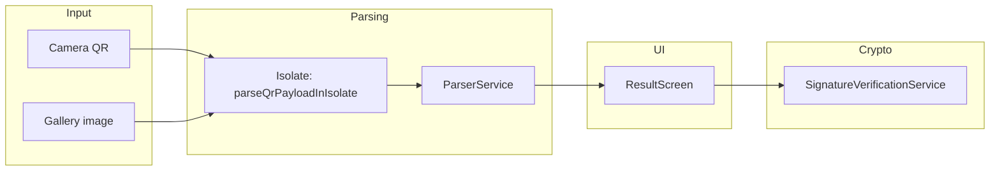

# Fayda Scanner

Flutter app that reads **Fayda-style** QR credentials: a **WebP photo** (Base64), **identity fields**, and a **detached JWT** after `:SIGN:`. It parses the payload off the UI thread, shows a result screen, and verifies **RS256** against a **single PEM public key** embedded in the app (no network, no JWKS).

**Repository:** [github.com/EtanaAlemu/fayda_scanner](https://github.com/EtanaAlemu/fayda_scanner)

It is an **independent reader**; it is not affiliated with any government or issuer unless you say so in your fork.

---

## How it works (high level)



1. **Scanner** (`ScannerScreen`) runs `mobile_scanner` with a **centered square ROI** (see `scan_window_layout.dart`). Only codes that intersect that region are analyzed. The camera uses a high analysis resolution, **QR-only** formats, **no digital zoom**, and **unrestricted** detection speed. On a timer, focus is nudged toward the scan window center.
2. When the raw string **looks complete** (`:DLT:` and `:SIGN:` present), the scanner **stops**, parses in a **background isolate** (`parseQrPayloadInIsolate`), then opens **ResultScreen**. The camera **resumes** when you pop the result.
3. **Parsing** (`ParserService`) splits on `:DLT:` and extracts fields and the JWT tail. For camera scans, **image Base64 is not decoded on the isolate** (`decodeImage: false`): `pendingImageBase64` is filled and **WebP bytes are decoded on the result screen** via `decodeQrImageInIsolate` so the first frame stays responsive on large payloads.
4. **Result screen** shows photo (if decoded), name, gender, DOB, ID, version, and runs **signature verification** with `rawSignedPayload` (exact text before `:SIGN:`) plus the JWT string.
5. **Gallery** (`ScannerGalleryFlow`, not on web): pick image → optional **crop** (`image_cropper`) → decode/analyze with progress UI; Android **back** can cancel. The flow uses tighter/precise scan strategies (including ML Kit corner hints where available) then reuses the same parse + navigation path.

---

## QR payload format

The scanner expects a single string (the QR “value”) in this **logical** shape:

```text
[BASE64_WEBP]:DLT:[FULL_NAME]:V:[VERSION]:G:[GENDER]:M:A:[ID_NUMBER]:D:[DOB]:SIGN:[JWT_COMPACT]
```

Notes:

- **`[BASE64_WEBP]`** — photo segment; Base64 may use normal or URL-safe alphabet; whitespace is stripped; padding is normalized before decode.
- **`:DLT:`** — delimiter between image and structured tail.
- **Tail fields** — parsed with `:KEY:VALUE` pairs for `V`, `G`, `D`, and `A` (or **`M:A:[ID_NUMBER]`** for the ID in the format above). The parser stops at **`SIGN`** and treats everything after `:SIGN:` as the **JWT** (the `:` inside the JWT are preserved by joining the remaining segments).
- **`:SIGN:`** — marks the start of the signature. **`rawSignedPayload`** is the full UTF-8 text **before** `:SIGN:` (used for **detached JWT** verification). The JWT’s middle segment may be **empty** in the compact form; the app then supplies the same logical payload by Base64url-encoding `rawSignedPayload` (no `=` padding) for the bytes-to-verify.

`ParserService.looksLikeCompletePayload` only checks that both `:DLT:` and `:SIGN:` appear — a cheap guard against partial reads while the QR is still on screen.

---

## Main packages & platform code

| Piece | Purpose |
|--------|--------|
| [`mobile_scanner`](https://pub.dev/packages/mobile_scanner) | Camera preview, QR detection, `scanWindow`, torch, camera switch |
| [`image_picker`](https://pub.dev/packages/image_picker) / [`image_cropper`](https://pub.dev/packages/image_cropper) | Gallery path and crop UI |
| [`pointycastle`](https://pub.dev/packages/pointycastle) + [`basic_utils`](https://pub.dev/packages/basic_utils) | RS256 verify, PEM → `RSAPublicKey` |
| `android/app` | `applicationId` / namespace (e.g. `com.etana.faydascanner`), release signing via optional `key.properties` |
| `android/key.properties.example` | Template for local release signing (real `key.properties` and `.jks` are **gitignored**) |

---

## Project layout

| Path | Role |
|------|------|
| `lib/main.dart` | `MaterialApp`, theme, home → `ScannerScreen` |
| `lib/screens/scanner_screen.dart` | Camera stack, ROI overlay, detect throttle, gallery entry |
| `lib/screens/scanner_controller_factory.dart` | `MobileScannerController` factory (QR-only, resolution, no auto-zoom) |
| `lib/screens/scanner_constants.dart` | Throttle, settle delays, camera target size, AF pulse interval |
| `lib/screens/scan_window_layout.dart` | `scanWindow` rect and normalized focus point |
| `lib/screens/scanner_overlay_painter.dart` | Dimmed overlay with clear “hole” over ROI |
| `lib/screens/scanner_gallery_flow.dart` | Gallery pick, modal progress, cancel, decode → parse → navigate |
| `lib/screens/result_screen.dart` | Identity UI, lazy image decode, clipboard for ID, signature status |
| `lib/services/parser_service.dart` | `parse`, `looksLikeCompletePayload`, isolate helpers |
| `lib/services/signature_verification_service.dart` | Detached JWT RS256 vs `_issuerRsaPublicKeyPem` |
| `lib/models/parsed_qr_data.dart` | `ParsedQRData`, `canonicalSigningPayload`, `applyDecodedImage` |
| `lib/utils/scanner_image_utils.dart` | PNG crops / helpers for gallery decode pipeline |
| `tool/build_android_release.sh` | Release AAB + per-ABI APK with obfuscation + `split-debug-info` |

---

## Signature verification (details)

- Algorithm: **RS256** only (`alg` in JWT header must be `RS256`).
- **Detached** compact JWT: signing input is ASCII  
  `base64url(header_json) + "." + base64url_utf8(rawSignedPayload)`  
  with **no `=` padding** on the payload segment, matching typical JWS detached behavior.
- Public key: set **`_issuerRsaPublicKeyPem`** in `lib/services/signature_verification_service.dart`. Only ship keys you are allowed to distribute.

---

## Build & run

```bash
git clone https://github.com/EtanaAlemu/fayda_scanner.git
cd fayda_scanner
flutter pub get
flutter run
```


**Android:** camera + media permissions in `AndroidManifest.xml`; for Play releases, copy `android/key.properties.example` → `key.properties` and point `storeFile` at your keystore (see comments in the example).

**iOS:** adjust usage descriptions in `ios/Runner/Info.plist` for App Store review.

**Release (Android):**

```bash
./tool/build_android_release.sh
```

Outputs under `build/app/outputs/…`. Debug symbols go to `./symbols` (gitignored) — keep them for de-obfuscating crashes if you use `--obfuscate`.

---

## Contributing

Issues and pull requests are welcome. Keep changes scoped and consistent with existing style.

## License

Add a `LICENSE` file before you publish (for example MIT, Apache-2.0, or your own terms) so others know how they may use the code.
